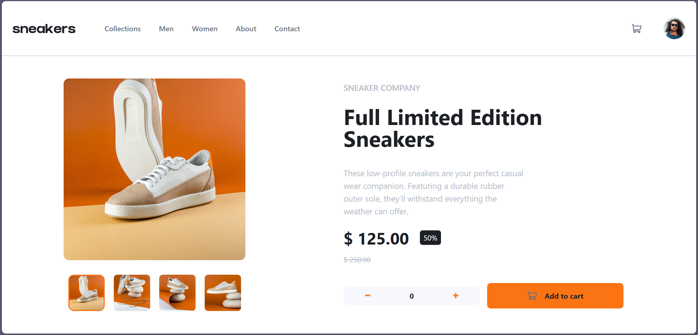

# Frontend Mentor - E-commerce product page solution

This is my solution to the
[E-commerce product page challenge](https://www.frontendmentor.io/challenges/ecommerce-product-page-UPsZ9MJp6)
on Frontend Mentor. The project focuses on building a responsive and interactive e-commerce product page using React and Redux.

---

## Overview

### The challenge

Users should be able to:

- View the optimal layout for the site depending on their device's screen size
- See hover states for all interactive elements
- Open a lightbox gallery by clicking on the main product image
- Switch product images using thumbnail images
- Add items to the cart
- View and remove items from the cart

### Screenshot

### Links

- Solution URL: https://www.frontendmentor.io/solutions/ecommerce-product-page  
- Live Site URL: https://adham-saeed630.github.io/Ecommerce-product-page/  

---

## My process

### Built with

- React.js
- Redux (state management)
- Tailwind CSS
- JavaScript (ES6+)
- Semantic HTML5
- Responsive design
- Mobile-first workflow

### What I learned

- Managing global state using Redux
- Handling cart logic and UI state efficiently
- Structuring React components for scalability
- Styling modern UIs with Tailwind CSS
- Building responsive layouts

### Continued development

In future projects, I want to focus on:

- Advanced Redux patterns
- Improving performance
- Accessibility best practices
- Cleaner project architecture

---

## Author

- Name: Adham Saeed
- Frontend Mentor: https://www.frontendmentor.io/profile/Adham-Saeed630
- GitHub: https://github.com/Adham-Saeed630

---

## Acknowledgments

Thanks to Frontend Mentor for providing high-quality challenges that improve real-world frontend development skills.
